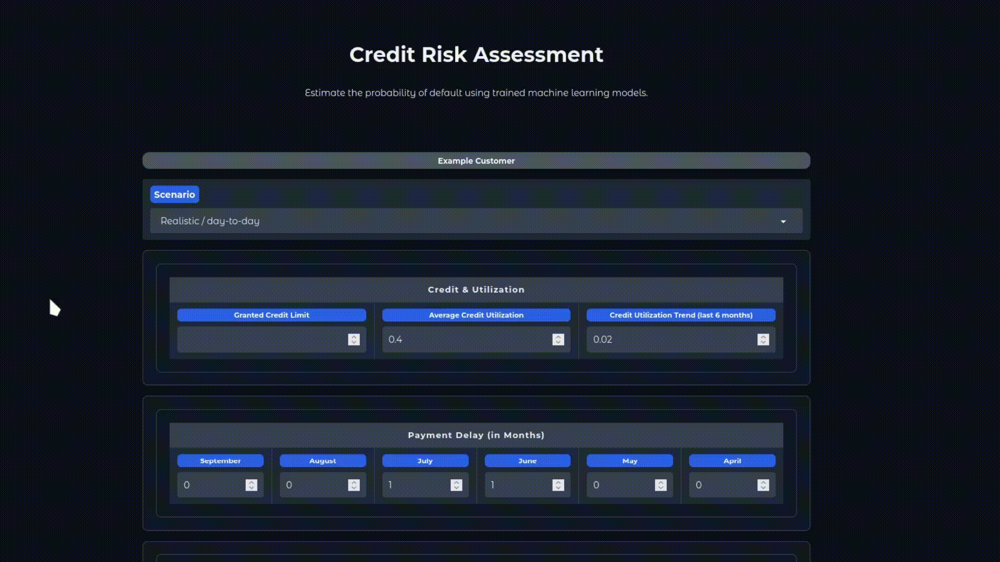
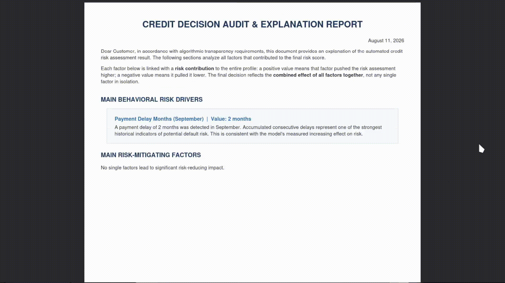

# Credit Risk Modeling and Robustness Analysis - Taiwan UCI Credit Dataset

[](#demo) [](https://www.python.org/) [](https://opensource.org/licenses/MIT)



> **SUMMARY:**
> An end-to-end, EU AI Act-compliant credit risk decision engine. Instead of optimizing standard statistical metrics like F1-score or ROC-AUC, this system maximizes **expected dollar-value profit** while evaluating model resilience against data corruption, missing features, and noise.

*A credit default model that is evaluated on estimated dollars, not accuracy, because a bank doesn't care about accuracy, it cares about profit and revenue to keep the bank working*

**Live demo:** [See instructions](#demo)

---

## 1. Problem framing

The dataset is the [Taiwan UCI Credit Card dataset](https://archive.ics.uci.edu/dataset/350/default+of+credit+card+clients)
(30'000 clients, April–September 2005). The task is not "predict default" in the
abstract, it's **decide whether to freeze a revolving credit line**, evaluated in monetary impact, not accuracy.

- **Objective**: maximize **expected economic value per customer**, not F1 score or ROC-AUC.
- **Why it matters**: accuracy-optimized classifiers routinely make decisions that lose more money than they save, because false positives and false negatives have wildly different costs in credit risk.
- **Constraint**: model must be interpretable and auditable (EU AI Act Annex III classifies credit scoring as high-risk).

## 2. Custom economic metric

Every classification outcome is mapped to a cash value based on the customer's
**Exposure at Default (EAD)**:

| Outcome | Decision | Cash impact |
|---|---|---|
| True Negative | Keep active - correct | +1% × EAD |
| False Negative | Keep active - wrong | −70% × EAD (LGD) |
| True Positive | Freeze - correct | −10% × EAD (recovery cost) |
| False Positive | Freeze - wrong | $0.00 (missed opportunity) |

The dataset's default rate (22.13%) is far above real-world monthly default rates for
revolving credit (~0.3%). Two independent corrections are applied:

1. **Probability calibration** (Saerens et al., 2002) — corrects what the model
   *believes*, applied both offline and at inference time.
2. **Outcome reweighting** — corrects how the imbalanced test sample is *counted*
   when aggregating portfolio-level value. Used in offline evaluations only, never in production.


## 3. Pipeline


- `01_Extracting_and_cleaning.ipynb` → First look and data cleaning
- `02_EDA_and_engineering.ipynb` → Exploratory Data Analysis and feature engineering
- `03_Preprocessing_and_modeling.ipynb` → Model selection and gridsearches
- `04_Testing_and_deploying.ipynb` → Model testing and deploying


| Notebook | What it does |
|---|---|
| `01` | Load raw UCI data, rename columns to explicit months, convert TWD→USD, dedupe, drop `AGE`/`SEX`/`EDUCATION`/`MARRIAGE` for EU AI Act compliance*. |
| `02` | EDA + feature engineering: `PAID_TO_REMAINING_*` (payment coverage), `CREDIT_UTIL_MEAN`/`CREDIT_UTIL_TREND` (utilization level and slope), drop raw `BILL_AMT*` to cut multicollinearity. |
| `03` | Leakage-free train/test split, winsorization + `RobustScaler` fit on train only, custom value metric, grid search over Logistic Regression / Random Forest / XGBoost with decision threshold treated as a first-class hyperparameter. |
| `04` | Monte Carlo noise injection, feature-dropping resistance, feature-importance stability under noise, SHAP-based audit reporting, final bootstrap evaluation, production packaging. |


**Even though the EU AI Act doesn't **prohibit** the use of demographical features in credit scoring, it was decided to drop them entirely from the beginning to **avoid any regulatory problem all together**, and to follow the rule of "evaluate from their behaviour, not their person"*


## 4. Models

Two candidates per architecture were retained from grid search (5-fold CV,
OOF probability calibration)

Baseline ("accept everyone"): **$12.65/customer/month**.

### Production architecture (triple-engine selection)

Models were selected per deployment scenario, not by a single leaderboard:

| Role | Model | Selected for |
|---|---|---|
| **Primary** | `RF_1` | Average expected profit under stable/nominal conditions |
| **Robust (1st backup)** | `LR_1` | Average expected profit under high noise / data degradation |
| **Failsafe (2nd backup)** | `LR_1` | Average expected profit under missing features (≥ 6 missing) |

*Note: `LR_1` appears both as Robust and Failsafe. This is not a typo, the selection criterion is "best performance per scenario", not "one model per role": if the same candidate wins in more than one scenario, it gets reused.*

## 5. Robustness testing

- **Monte Carlo noise injection:** Gaussian perturbation on continuous features, stochastic ±1 ordinal shift on `PAY_*`, swept σ ∈ [0, 0.50].
- **Feature dropping:** up to 50% of features masked and median-imputed, 100 MC iterations per drop level.
- **Feature importance stability:** cosine similarity between clean and
  noise-retrained importance/coefficient vectors, Top-5 and Top-10 subspaces.
- **SHAP:** per-customer explainability + automated PDF "adverse action" report generation.

*Example of an audit report*



---

## 6. Final evaluation (bootstrap, n=10,000)

Paired bootstrap resampling on the held-out test set, evaluating the **Primary model (`RF_1`)** under clean conditions versus the **Robust model (`LR_1`)** under the "Uncertain World" noise-weighted scenario:

| Scenario | Profit/cust/month | 95% CI | Uplift vs. baseline | P(> baseline) |
|---|---|---|---|---|
| **Primary - clean (`RF_1`)** | $12.93 | [$12.16, $13.72] | +$0.28 | 76.0% |
| **Robust - noisy (`LR_1`)** | $12.74 | [$11.97, $13.52] | +$0.09 | 59.1% |

**Paired delta (Primary − Robust):** +\$0.19/cust, 95% CI [\$0.06, \$0.33], $P(\text{Primary} > \text{Robust}) = 99.8\%$.

> **Honest Framing & Critical Takeaway:**
> - **Absolute Uplift vs. Baseline:** Neither model's *absolute* uplift 95% CI excludes zero (`RF_1`: [-\$0.49, +\$1.07]; `LR_1`: [-\$0.68, +\$0.87]). This reflects the high inherent variance in monthly credit portfolio returns under extreme credit card exposure distributions.
> - **Paired Comparison:** In contrast, the *paired* delta CI **[\$0.06, \$0.33] strictly excludes zero**, with a $99.8\%$ probability that `RF_1` outperforms `LR_1` when operating under clean data conditions.
>
> This demonstrates two separate insights: while portfolio-level absolute profitability is volatile, the performance ranking between primary and backup architectures is statistically robust.

Scaled to an assumed monthly portfolio of 2M customers, the **Primary model (`RF_1`)** yields an expected point-estimate gain over baseline of **$+\$567,366/month$ (+\$6,808,393/year)**, with 95% CIs of [-\$984,416, +\$2,148,323]/month and [-\$11,812,997, +\$25,779,877]/year respectively.

## 7. Design decisions & known limitations

- `π_real = 0.003` and the `TWD/USD rate = 0.031` are fixed, order-of-magnitude constants, chosen for reproducibility, not historical precision.
- `AGE`, `SEX`, `EDUCATION`, `MARRIAGE` are dropped entirely rather than retained
  under a formal fairness audit as a conservative approach to avoid any possible problem with demographical discriminations (EU AI Act Annex III).
- Winsorization thresholds for engineered features (`PAID_TO_REMAINING_*` cap
  2.0, `CREDIT_UTIL_MEAN` cap 1.5, `CREDIT_UTIL_TREND` cap ±0.3) are
  domain-driven, not statistically derived.

## 8. Repo structure

```text
├── data/       # Raw, cleaned, and engineered datasets (train/test splits)
├── models/     # GridSearches, candidate models, and final production artifacts (.joblib)
├── tests/      # Test outputs (noise injection, feature drop, cosine similarity, SHAP)
├── demo/       # Self-hosted production demo (see note below)
└── gifs/       # Example gifs for the demo (without needing to set up the environment)
LICENSE         # MIT license
README.md       # Project overview and documentation
requirements.txt # Dependencies for reproducibility
*.ipynb         # Notebooks (01 → 04)
```

> **Why self-hosted?**
> The original plan was to host a live demo on Hugging Face Spaces. However, recent changes to the available free-tier hardware make ZeroGPU the only free option for this Space without a PRO subscription. Since the demo is a lightweight CPU-based application that does not require GPU acceleration, and ZeroGPU is subject to strict time and compute limitations on the free plan, it is not a suitable fit.
>
> The demo is therefore provided as a self-hosted application that can be run locally on the reader's machine. See the following section for instructions.

## 9. Reproducing this project

**IMPORTANT!** Due to GitHub's file size limitation (100 MB per file), the SHAP explainers are stored in compressed `.gz` format.

Before running anything, decompress all `.gz` files by running this command in the project root directory `./`:

```bash
find . -name "*.gz" -exec gzip -dk {} +
```

*(The use of a virtual environment is encouraged.)*

### 1. Run the notebooks

From the project root:

```bash
pip install -r requirements.txt
```

Then run notebooks `01 → 02 → 03 → 04` in order using the correct environment and your preferred IDE.

<a id="demo"></a>

### 2. Run the self-hosted demo

**IMPORTANT!**

If not done already, decompress all `.gz` files by running this command in the project root directory `./`:

```bash
find . -name "*.gz" -exec gzip -dk {} +
```

Then, from `./demo`:

```bash
pip install -r requirements.txt
```

Then start the application:

```bash
python app.py
```

Access the web interface at:

```text
http://127.0.0.1:7860
```

## 10. Author

**Francesco Scolz**
* [LinkedIn](https://www.linkedin.com/in/francesco-scolz/)
* [GitHub](https://github.com/FreyFlyy)
* [Hugging Face](https://huggingface.co/FreyFlyy)

## 11. License

Distributed under the **MIT License**. See `LICENSE` for more information.
